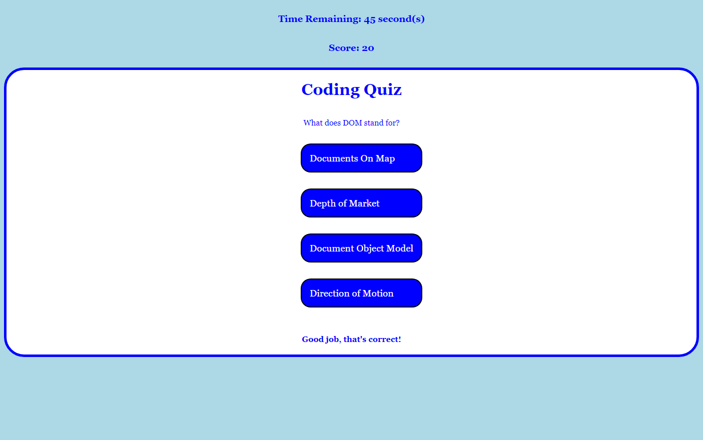

# Coding Quiz

## Description

This project is a multiple choice coding quiz. You have 60 seconds to complete the quiz with each question being worth 20 points. If the user selects the correct answer, they will add 20 points to their score, but if the user selects the incorrect answer, 10 seconds will be deducted from their total time left. At the end of the quiz, the user can submit their name and their score will be added to the highscores list where it will be saved for future reference.

## Usage/Examples

To take this quiz, simply press the "Start Quiz" button. You can select an answer by clicking the corresponding button. To submit your score, type your name into the input field, then press the "Submit Score" button. To access the highscore list press the "View Highscore" button at the top left of the page. To clear the highscores, press the "Reset Scores" button. If you would like to retake the quiz after completion, press the "Retake Quiz" button.

## Screenshot of quiz home page

## Screenshot of active quiz

## Screenshot of correct answer

## Screenshot of incorrect answer

## Screenshot of score submission

## Screenshot of highscores

## 🔗 Project-Links
- [Deployed Application](https://jeaustins27.github.io/Code-Quiz/)
- [GitHub Repo](https://github.com/jeaustins27/Code-Quiz)

## Credits

- [W3 Schools](https://www.w3schools.com/)
- [ReadME.so](https://readme.so)

## License

[MIT](https://choosealicense.com/licenses/mit/)

